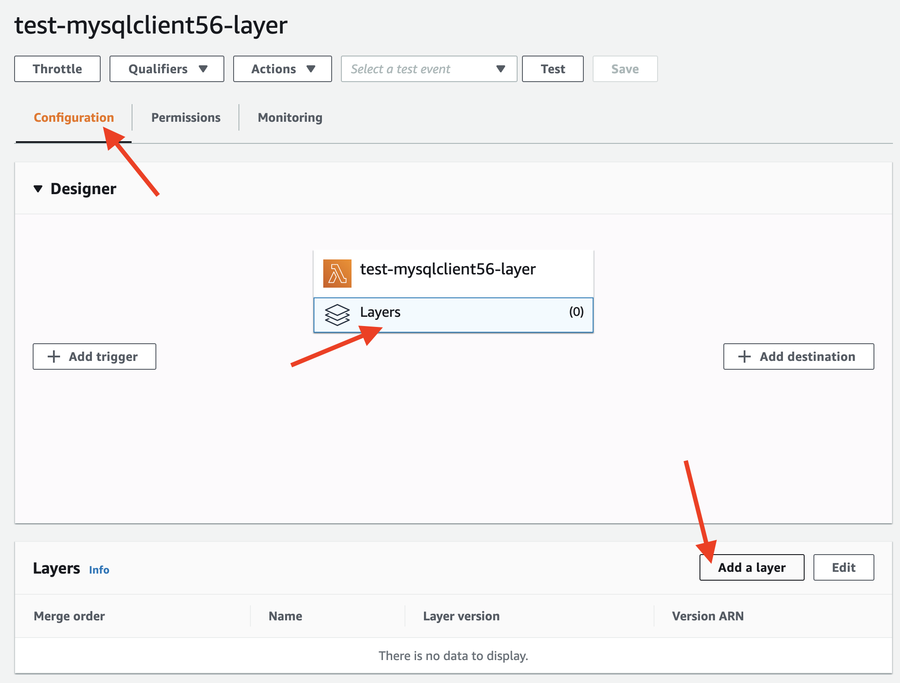
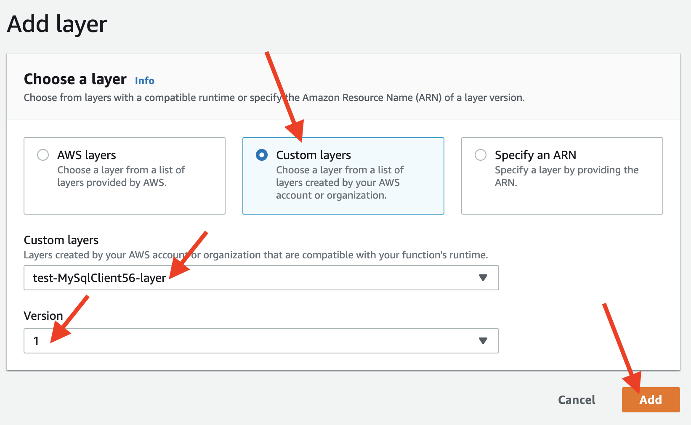
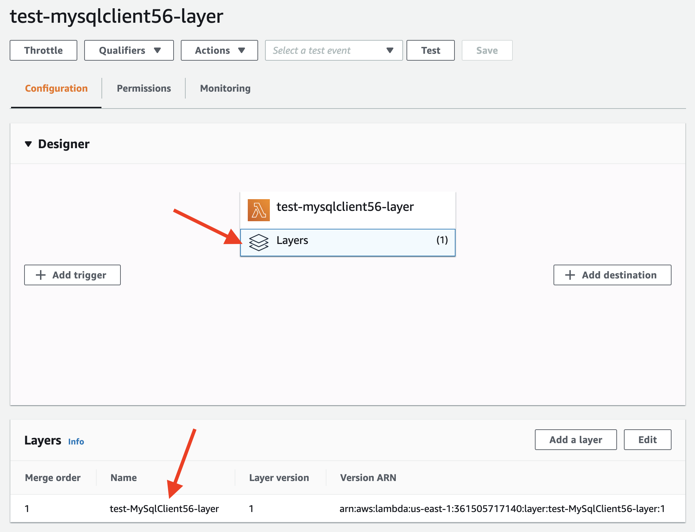

# AWS Lambda layer for `mysqlclient` (or any other Python package)

This project provides:

1. Ready-made AWS layer zips for the Python [mysqlclient](https://github.com/PyMySQL/mysqlclient-python) (aka MySQLdb) package: for MySQL 5.6 and MySQL 8.0
2. An easy, docker-based solution for building your own AWS layer: for `mysqlclient` for ANY version of MySQL server and ANY version of Python too.
3. An easy, docker-based, completely generalized solution for building your own AWS layer for ANY Python package for ANY Python version. This is especially useful for importing and using Python packages with platform-specific dependencies (e.g. the package uses `.so` files via FFI) in AWS Lambda. These packages are usually non-trivial to use in AWS Lambda for reasons described below. Example packages that fit these criteria: pandas, numpy, cchardet. If you have this use-case, use the `general-purpose` branch.

## TLDR

If you need a ready-made, tested AWS Layer for `mysqlclient`, just use `build_output/layer.zip` according to this table:

| Python Version  |  MySQL Version | Branch to use  |
|---|---|---|
| 3.x  |  MySQL v8.0.x |  master |
| 3.x  |  MySQL v5.6.x  |  mysql-5.6 |
| 3.x | I want to build an AWS Lambda layer for a non-MySQL Python package| general-purpose |

If your use-case is not reflected in the table above (for example, you need to target a different version of MySQL and/or a different version of Python) then you can build your own AWS layer with the tools provided in this repo. Read on for more instructions.


### Short HowTo

- Switch to the appropriate branch as per the table above.
- Either use the already-provided `build_output/layer.zip` or build your own `layer.zip` as described below.
- Upload `layer.zip` as an AWS Layer to your AWS account. For details on this step, see the [create a new AWS layer with `layer.zip`](https://github.com/nonbeing/mysqlclient-python3-aws-lambda#create-a-new-aws-layer-with-layerzip) section.
- Configure your AWS Lambda Python function to use your newly-created layer.
- Profit!


## `mysqlclient`: simple, sufficient test for your new AWS Lambda layer

After you create the required layer in AWS Lambda, you can configure your Lambda function to use this layer and simply `import MySQLdb` (as an example) in your Lambda function. The import should work just fine, without and errors if you are using the right Lambda layer and you have configured your Lambda function to use your Lambda layer correctly.

Here's a barebones example to test if you are able to import and use `mysqlclient` correctly:

```python
import MySQLdb

def lambda_handler(event, context):
    return {
        'statusCode': 200,
        'body': 'MySQLdb was successfully imported'
    }
```

If you get the success message and don't see an error like `ModuleNotFoundError: No module named 'MySQLdb'` or `ImportError: No module named _mysql`, then you're all set to use `mysqlclient` on AWS Lambda - the Lambda layer is working just fine for you.

## Motivation

`mysqlclient` is usually the first choice for connecting to a MySQL database in Python because of its top-notch performance in most use-cases.

However, since it is a thin wrapper on a C-implementation, it has dependencies on a `libmysqlclient.so` binary, and is thus not a "pure-python" implementation. The binary it depends on, unfortunately, introduces platform-specific dependencies. For example, you can't use `mysqlclient` on AWS Lambda with a binary compiled for another platform such as Mac OS. The `libmysqlclient.so` for AWS Lambda needs to be compatible with the specific `Amazon Linux 2` environment that AWS Lambda runs in, and this can be tedious to get right.

Therefore, it is non-trivial to use `mysqlclient` in AWS Lambda Python code, especially when you want to deploy it in an [AWS Lambda Layer](https://docs.aws.amazon.com/lambda/latest/dg/configuration-layers.html).

### goal

The goal of this project is to provide an easy way to build an AWS Lambda layer for `mysqlclient` so that this package can be readily used in an AWS Lambda Python function. By including the layer in your Lambda function configuration, you can just `import MySQLdb` as usual and get on with your actual code.

### mysqlclient

[mysqlclient](https://github.com/PyMySQL/mysqlclient-python) is a mature, stable driver for MySQL, actively maintained by members of the PyMySQL community, and [available on PyPI](https://pypi.org/project/mysqlclient/). It provides a Python wrapper around the MySQL C API; the [core is implemented in C](https://mysqlclient.readthedocs.io/user_guide.html).

`mysqlclient` is usually the top choice from among `mysqlclient`, `pymysql` and Oracle's `MySQL-Connector` for connecting to a MySQL DB in Python. It is typically the most performant of the lot and is very stable. However, there can be good reasons to choose any one of these drivers over the others - it depends on your use-case.

`mysqlclient` is a [top recommendation on the SQLAlchemy MySQL driver page](https://docs.sqlalchemy.org/en/13/dialects/mysql.html#module-sqlalchemy.dialects.mysql.mysqldb):

> mysqlclient supports Python 2 and Python 3 and is very stable.

> The recommended MySQL dialects are mysqlclient and PyMySQL.

### pymysql

The PyMySQL community also actively maintains another project, called [`PyMySQL`](https://github.com/PyMySQL/PyMySQL), which is a pure-python implementation. This has benefits such as not having platform-specific dependencies like `mysqlclient`. So it would seem a better fit for AWS Lambda given that it doesn't need special work (as compared to `mysqlclient`). However, it generally offers poorer performance - up to 10x slower than `mysqlclient` in some cases. Though `pymysql` aims to be 100% compatible with MySQLdb, there can be undesirable edge cases, especially when combined with other popular data-science pacakges such as `Pandas` and `SQLAlchemy`. As an example, we discovered that writing the same df with `to_sql` behaved slighly differenly across `mysqlclient` and `pymysql`. So we decided to stick to `mysqlclient` for these reasons.

### mysql-connector

Oracle (owner and maintainer of `MySQL`) also provides a pure-python library for talking to MySQL called [`MySQL Connector`](https://dev.mysql.com/doc/connector-python/en/). This is the "official" driver for Python from MySQL.

Note that SQLAlchemy [doesn't recommend](https://docs.sqlalchemy.org/en/13/dialects/mysql.html#module-sqlalchemy.dialects.mysql.mysqlconnector) using this driver:

> Note

> The MySQL Connector/Python DBAPI has had many issues since its release, some of which may remain unresolved, and the mysqlconnector dialect is **not tested as part of SQLAlchemy’s continuous integration**. The recommended MySQL dialects are mysqlclient and PyMySQL.

### performance comparison

`mysqlclient` can run 5x-to-10x faster (on CPython) than `pymysql`, according to these discussions and tests:

- https://wiki.openstack.org/wiki/PyMySQL_evaluation#Architecture_and_Performance
- http://charlesnagy.info/it/python/python-mysqldb-vs-mysql-connector-query-performance
- https://www.programmersought.com/article/4675925085/
- https://gist.github.com/methane/90ec97dda7fa9c7c4ef1
- https://stackoverflow.com/questions/43102442/whats-the-difference-between-mysqldb-mysqlclient-and-mysql-connector-python
- https://stackoverflow.com/questions/51152183/fastest-way-to-read-huge-mysql-table-in-python

`pymysql` could possibly be as fast as (or faster than) `mysqlclient` if used with `PyPy`, but according to [this post on StackOverflow](https://stackoverflow.com/a/52685419/376240), `mysqlclient` is still faster, even on PyPy3.7

### summary

For most use-cases, `mysqlclient` is the preferred choice of DB connector to MySQL, but it is not straightforward to use on AWS Lambda's Python runtime.

This project attempts to solve (or at least alleviate) this problem to a large extent by providing a relatively-straightforward path to building an AWS Layer for `mysqlclient` which can then be readily consumed in AWS Lambda Python functions.

# Usage

## Building your own Lambda layer.zip for ANY Python package

Skip the following steps if you are using any of the provided, ready-to-use `layer.zip` files. Go directly to [create a new AWS layer with `layer.zip`](https://github.com/nonbeing/mysqlclient-python3-aws-lambda#create-a-new-aws-layer-with-layerzip) instead.

If you need to build your own Lambda layer from scratch, read on...

### build prerequisites

You need a `*nix` environment where you can run docker commands and bash scripts. This project has been tested on Ubuntu 20.04, WSL2 on Windows 10 Pro and MacOS.

Ensure you have docker installed; you should be able to run `docker --version` without any issues. The script will pull a [`lambci` image from docker hub](https://hub.docker.com/r/lambci/lambda) as the first step of the build. This `lambci` image will be used to build a local docker image using the `Dockerfile`.  If you are using one of the `mysql` branches or `master` branch, the script will also install the appropriate `mysql-devel` package which is necessary for building the `libmysqlclient.so`.

### build the layer locally

- Clone this repo.
- Switch to the appropriate branch (see table above). If you are not building for `mysqlclient`, use the `general-purpose` branch.
- Review the Dockerfile. You may need to edit this as per your needs (e.g. not building a layer for `mysqlclient`, but for some other Python package).
- Review `requirements.txt`. You may need to edit this file - it should have the Python package for which you are building an AWS Lambda layer.
- Review the `pip_and_copy.sh` script. You may need to edit this as per your needs (e.g. not building a layer for `mysqlclient`, but for some other Python package).
- Invoke the `build.sh` shell script (e.g. by `bash build.sh`).

The `build.sh` script will perform all the necessary steps and if successful, will produce a `layer.zip` file in the `build_output` directory.

`build.sh` will use the `Dockerfile` to build a docker image based off the `lambci/lambda:build-python3.8` image that very-closely replicates the AWS Lambda environment. Any build dependencies (e.g. RPM packages needed in the build environment) should be specified in the `Dockerfile` beforehand.

After the docker image has been built, `build.sh` runs `pip_and_copy.sh` which in turn runs `pip install -r requirements.txt` and copies over the necessary `.so` file to the output directory. Finally, `build.sh` zips up the build artifacts in the `build_output/python` and `build_output/lib` directories into a zip ready for upload. This `layer.zip` file is the final artifact, ready-to-upload to AWS Lambda for your new layer.

If you are building a layer for `mysqlclient`, `build.sh` specifically does the following:
- Downloads and installs the correct, appropriate `mysql-community-devel` RPM in the docker image. This is necessary to `pip install mysqlclient` in Amazon Linux 2.
- Invokes `pip_and_copy.sh` to `pip install mysqlclient` and copy the correct `.so` file and the python libs out from the docker container and into the `build_output/python` directory.
- Zips the `build_output/python` and `build_output/lib` dir into `build_output/layer.zip`.

### full example for building a layer for ANY Python package

Check out the `cchardet-wheel` branch and view `Dockerfile` and `pip_and_copy.sh` files. This branch was created to build the [cchardet](https://github.com/PyYoshi/cChardet) Python package (https://pypi.org/project/cchardet) for AWS Lambda. This is a different procedure from how `mysqlclient` is built.


## Create a new AWS layer with `layer.zip`

You should upload `layer.zip` as-is; you don't need to zip or unzip anything.

The easiest way is to use the AWS Lambda web console. Of course, there are many ways to create a new layer from a zip, including the AWS CLI. You could potentially also use the [Serverless Framework](serverless.com) for this.

For a nice blog post with screenshots on how to upload a zip file as a new layer to AWS Lambda, read the [Deploying our Layer](https://www.freecodecamp.org/news/lambda-layers-2f80b9211318/) section.

## Reference the newly-created layer in your lambda function

Here's how to add your new layer to your Lambda function's configuration.

In the AWS Lambda Web Console:

### step 1

Go to the function configuration, click `Layers` and then click the `Add a layer` button.



### step 2

On the `Add Layer` page, select `Custom layers`, then select the exact custom layer in the dropdown.

Next, select the version of the custom layer. If this is a brand-new layer, it will only have one version: select version `1`.

Click the `Add` button.



### step 3

Finally, confirm that the custom layer has been added to your Lambda function as shown here:


## Import and run!

Finally, you can simply `import MySQLdb` in your Python3 Lambda function; here's a barebones example:

```python
import MySQLdb

def lambda_handler(event, context):
    return {
        'statusCode': 200,
        'body': 'MySQLdb was successfully imported'
    }
```

If you get the success message and don't see an error like `ModuleNotFoundError: No module named 'MySQLdb'` or `ImportError: No module named _mysql`, then you're all set to use `mysqlclient` on AWS Lambda.

# Feedback and Contributions

... are most welcome. Please file PRs and issues as you see fit. Will respond to them as soon as possible.

# Troubleshooting

See the [`mysqlclient` FAQ](https://github.com/PyMySQL/mysqlclient-python/blob/a33e1c38363b8c71775394965ca70d576ffd3a90/doc/FAQ.rst) that covers troubleshooting for common error cases, including build errors.

# Credits and Thanks

The work in this repo is largely based off Seungyeon Kim(Acuros Kim)'s project at: https://github.com/StyleShare/aws-lambda-python3-mysql - thanks!

I have adapted that project to build an AWS Layer using a different MySQL-devel package (the one meant for MySQL 8.0.x instead of 5.5) and targeting Python 3.8 (instead of 3.7) - as of this writing.

Thanks also to Michael Hart for [LambCI](https://github.com/lambci/lambci) - without the LambCI docker images, none of these kinds of solutions would be doable this easily.
